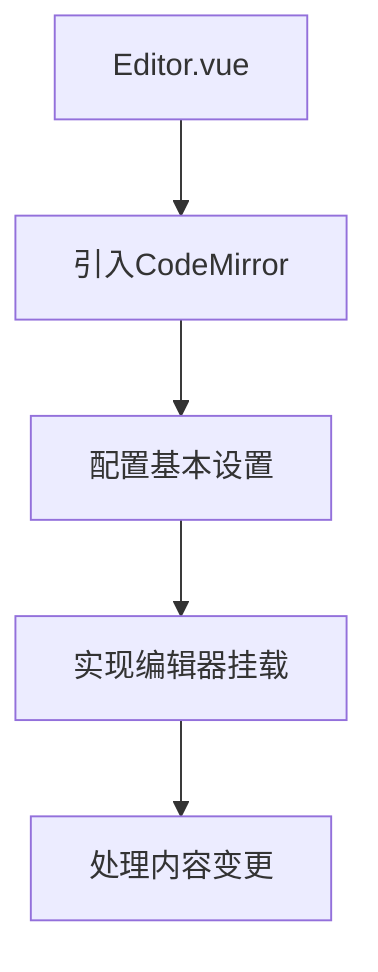
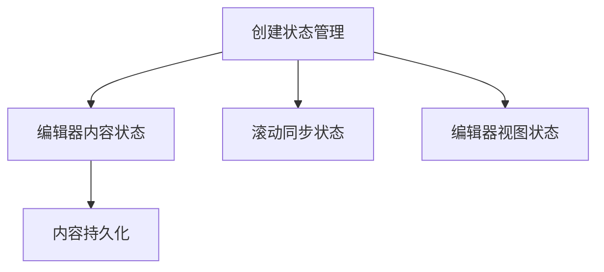
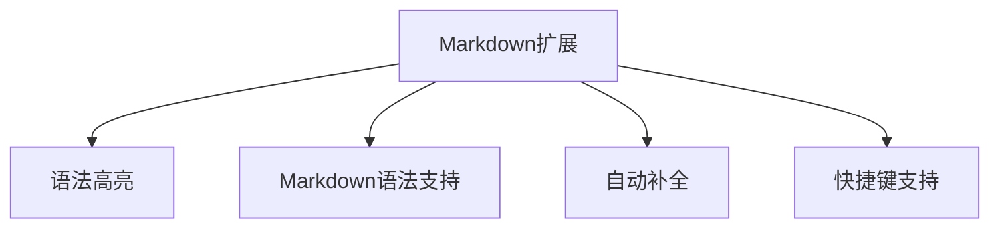
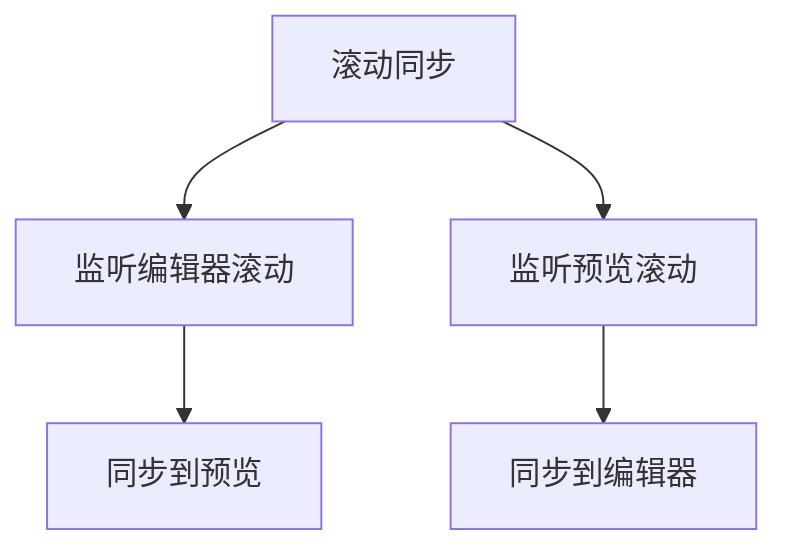
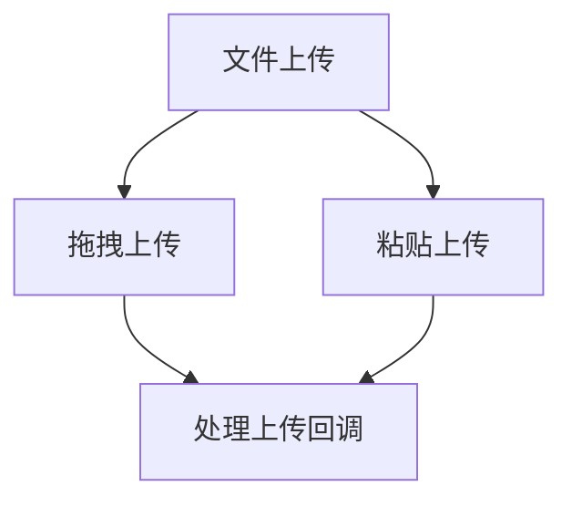

# Vue Markdown编辑器实现计划

根据我对React版本Markdown编辑器的分析和Vue项目的现有结构，我为您规划了Vue版Markdown编辑器的Editor功能实现方案。

## 当前项目状态

目前您的Vue项目已经有了基本的结构：
- App.vue：主应用组件，包含Editor和Preview的布局
- Editor.vue：编辑器组件，目前只有一个简单的textarea
- Preview.vue：预览组件，目前只显示"test"文本

项目已安装了必要的依赖：
- CodeMirror 6相关包
- markdown-it用于Markdown解析和渲染

## Editor功能实现计划

### 1. 基础编辑器实现

首先，我们需要使用CodeMirror替换当前的textarea，实现基本的编辑功能：

### 2. 状态管理实现

我们需要创建一个状态管理系统来管理编辑器内容和视图：

### 3. Markdown扩展功能

为编辑器添加Markdown特定的功能：

### 4. 滚动同步功能

实现编辑器和预览区域的滚动同步：

### 5. 文件上传功能

实现拖拽和粘贴上传文件的功能：

## 具体实现步骤

### 第一阶段：基础编辑器实现

1. **创建编辑器状态管理**
   - 使用Vue的响应式系统（ref, reactive）创建编辑器状态
   - 实现内容的本地存储和读取

2. **基础编辑器组件实现**
   - 使用CodeMirror替换textarea
   - 配置基本的编辑器选项（行号、主题等）
   - 处理编辑器内容变更事件

### 第二阶段：Markdown功能增强

1. **添加Markdown语法支持**
   - 配置CodeMirror的Markdown语言支持
   - 添加语法高亮

2. **实现编辑器扩展**
   - 添加快捷键支持
   - 实现自动补全功能

### 第三阶段：滚动同步和文件上传

1. **实现滚动同步**
   - 监听编辑器和预览区域的滚动事件
   - 实现双向滚动同步

2. **实现文件上传**
   - 添加拖拽上传功能
   - 添加粘贴上传功能

## 技术选择

1. **编辑器核心**：CodeMirror 6
2. **Markdown解析**：markdown-it
3. **状态管理**：Vue的响应式系统（ref, reactive）
4. **样式处理**：CSS Scoped Styles

## 需要创建的文件

1. **编辑器相关**
   - `src/composables/useEditorState.ts`：编辑器状态管理
   - `src/composables/useEditorContent.ts`：内容持久化
   - `src/composables/useScrollSync.ts`：滚动同步

2. **工具函数**
   - `src/utils/handleScroll.ts`：处理滚动同步
   - `src/utils/fileUpload.ts`：处理文件上传

3. **扩展功能**
   - `src/extensions/codemirror.ts`：CodeMirror扩展配置

## 下一步行动

1. 首先实现基础的CodeMirror编辑器
2. 添加Markdown语法支持和高亮
3. 实现内容持久化存储
4. 添加滚动同步功能
5. 实现文件上传功能
